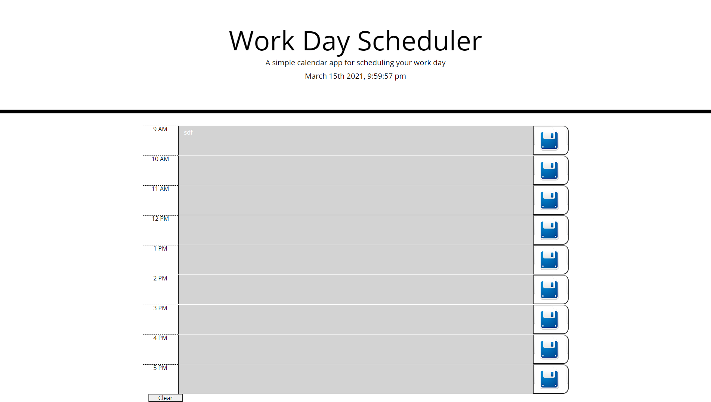

Repo: https://github.com/Sergey-ddbug/WorkDayPlaner
Link: https://sergey-ddbug.github.io/WorkDayPlaner/

* Dayly Planer!
* I am using a daily planner to create a schedule.
* When you open the planner you will see timeblocks for standard business hours
* Each timeblock is color coded to indicate whether it is in the past, present, or future
* In each timeblock you can type anything you need , also you can save it in local storage and it will stay there until you will click a button "clear".
  
